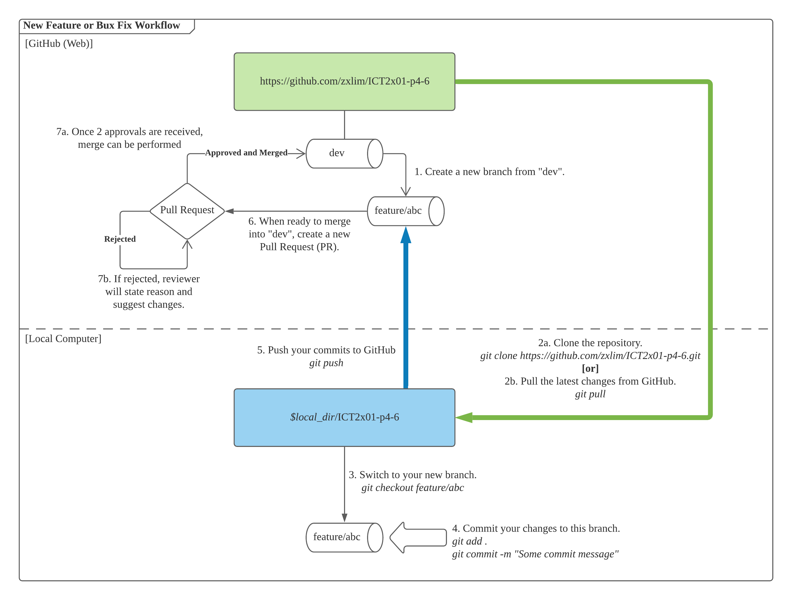
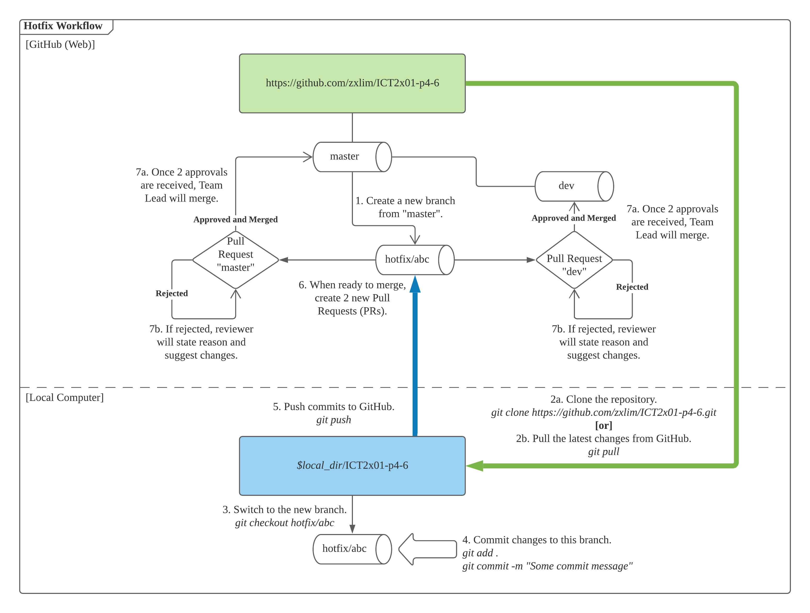

# BOTster
BOTster is a gamified feedback system used to engage primary school students on the topics of problem solving and computational thinking skills through block-based logical programming. Students will control a robotic car to complete challenges using a web interface.

## Table of Contents
- [Repository Structure](#repository-structure)
- [Deployment Instructions](#deployment-instructions)
    - [Dependencies](#dependencies)
    - [Starting the Application (For macOS/Linux)](#starting-the-application-for-macoslinux)
    - [Starting the Application (For Windows)](#starting-the-application-for-windows)
- [Development Workflow](#development-workflow)
    - [Branches](#branches)
        - [Naming and Terminology](#naming-and-terminology)
        - [Branch Protection](#branch-protection)
    - [Summary of Workflow](#summary-of-workflow)
    - [New Feature or Bug Fix](#new-feature-or-bug-fix)
    - [Merging into `master` branch](#merging-into-master-branch)
    - [Deploying Hotfixes](#deploying-hotfixes)

## Repository Structure
    ICT2x01-p4-6
    ├── config              # Directory containing PHP configuration files used for running BOTster.
    ├── docs                # Directory containing resources for project documentation.
    ├── src                 # Directory containing project source code.
    └── README.md           # This README file. Contains the key project documentation.

## Deployment Instructions
This section will cover the deployment instructions for this application.

### Dependencies
The following software are required to be installed on the machine running this application:
- PHP 7.4
- SQLite3

On macOS Catalina and later, PHP is already preinstalled with SQLite support. For Debian-based GNU/Linux systems, the dependencies can be installed using the following commands:
```bash
dev@p4-6:~$ sudo apt update && sudo apt install -y php7.4-cli php7.4-common php7.4-json php7.4-readline php7.4-sqlite3
```

On Windows, PHP 7.4 must be installed using XAMPP with default settings. [Click here to download the correct version](https://www.apachefriends.org/xampp-files/7.4.25/xampp-windows-x64-7.4.25-0-VC15-installer.exe).

The machine running this application shall also be connected to a network that has wireless connection capabilities (WiFi) for the Robotic Car to be able to communicate with the web component of this application.

### Starting the Application (For macOS/Linux)
Steps shown here are done using a Terminal.

1. Clone the repository.
```bash
dev@botster:~$ git clone https://github.com/zxlim/ICT2x01-p4-6.git
```

2. Set your current working directory to the repository on your local file system.
```bash
dev@botster:~$ cd ICT2x01-p4-6
```

3. Run `start.sh` to start BOTster.
```bash
dev@botster:~/ICT2x01-p4-6$ ./start.sh
PHP 7.4.26 Development Server started at Fri Nov 19 00:00:00 2021
Listening on http://127.0.0.1:5000
Document root is /home/dev/ICT2x01-p4-6/src
Press Ctrl-C to quit.
```

### Starting the Application (For Windows)

1. Clone the repository using [Git Bash](https://gitforwindows.org/).
```bash
dev@botster MINGW64 ~ git clone https://github.com/zxlim/ICT2x01-p4-6.git
```

2. Open the repository folder using File Explorer by double-clicking it in the respective directory.

3. Double-click on `start.bat` to start BOTster. A Command Prompt window will open with the following output:
```batch
[*] Press Ctrl+C to stop BOTster Web.
[*] Document root is: C:\Users\dev\ICT2x01-p4-6\src
[Fri Nov 19 12:58:19 2021] PHP 7.4.25 Development Server (http://127.0.0.1:5000) started
```

## Development Workflow
This section will contain the necessary information for the project development workflow.

### Branches
#### Naming and Terminology
- `master`: Contains production-ready code and/or other "critical" resources (Important for the progression of the project).
- `dev`: Contains code and resources that are of "release-candidate" standards and ready to be staged for production.
- `feature/x`: Contains development code for a feature `x` as described in a related GitHub Issue. Branch will be merged into `dev` when feature is deemed complete.
- `bugfix/x`: Contains development code for a bug fix `x` as described in a related GitHub Issue. Branch will be merged into `dev` when bug fix is deemed complete.
- `hotfix/x`: Contains development code for an **urgent** bug fix `x` as described in a related GitHub Issue. A bug is defined as "urgent" if it severely degrades the functionality of the application in production (E.g. Causes the application to crash).

#### Branch Protection
Branch protection is enforced on the following branches:
- `master`
    - **Pull Request required**: Commits must be made to another branch first, then merged via a PR to this protected branch.
    - **Approval required**: 1 reviewer is required to approve the PR for the merge feature to be available.
- `dev`
    - **Pull Request required**: Commits must be made to another branch first, then merged via a PR to this protected branch.
    - **Approval required**: 2 reviewers are required to approve the PR for the merge feature to be available.

### Summary of Workflow
1. No one shall directly commit into `master` or `dev` branch.
2. New features and bug fixes shall only be made in `feature/` or `bugfix/` branches respectively, which shall be derived from the `dev` branch.
3. Hotfixes shall only be made in a `hotfix/` branch, which shall be derived from the `master` branch.
4. Commits shall only be introduced into the `master` or `dev` branches via Pull Requests (PR).
5. PR authors are not allowed to review or approve their own changes.
6. PRs that involve the `master` branch can only be created by the Team Lead, unless it is a hotfix. Only the Team Lead is allowed to perform a merge into `master` branch after approval is given by the assigned reviewer(s).
7. No branches shall be deleted without the approval of the Team Lead.

### New Feature or Bug Fix

<br /><br />
**1. Open a new Issue on GitHub**
<br />
- Describe the feature that is being worked on.
- Assign it to the relevant person(s).
- Label the Issue accordingly (Is this a bugfix, documentation or enhancement related?).
- Add the Issue to the `ICT2101/2201 Team Project` Project Board and set the appropriate column depending on the Issue status.
- Add the Issue to the `Milestone 3 (Project Development)` Milestone.

**2. Branch off from `dev` branch on GitHub**
<br />
Create a new branch off from the `dev` branch with a descriptive name starting with `feature/` or `bugfix/` (E.g. `feature/documentation` or `bugfix/command-parsing-issue`)

**3. Work on the Issue in the new branch**
<br />
Commit all additons or changes to the newly created branch. **Only work within the scope of the described Issue** (Do not make changes that are irrelevant to the Issue).

**4. Create a Pull Request (PR) on GitHub**
<br />
Once all the necessary commits are pushed, open a new PR (`feature/` or `bugfix/` into `dev`) and tag the related GitHub Issue. If possible, mark the PR with a relevant Label. Provide a summary of the changes made.

**5. Wait for PR Approval**
<br />
2 reviewers are to check and verify the changes before approving the PR. Reviewers have the right to request for changes to the PR by providing comments to support their justification.

**6. Perform merge commit via GitHub**
<br />
Once approval requirements have been met, use the `Merge Commit` feature on the respective PR page to merge the approved changes into the `dev` branch. Merging can be done by the final approver. **Only perform merging using the GitHub web interface!** Once merged, **do not delete** the feature branch.

### Merging into `master` branch
Only production-ready code (Meant for release) and other critical resources shall be merged into `master` from `dev`. Only the Team Lead is allowed to create such PRs and complete the merge as these processes involes the `master` branch.
<br /><br />
**1. Create a Pull Request on GitHub**
<br />
The Team Lead will open a new PR (`dev` into `master`) and provide a summary of the changes made. The Team Lead must assign a minimum of 1 reviewer to this PR.

**2. Wait for PR approval**
<br />
The assigned reviewer(s) are required to check and verify the changes before approving the PR. The reviewer have the right to request for changes to the PR by providing comments to support their justification.

**3. Perform merge commit via GitHub**
<br />
Once approval requirements have been met, the Team Lead will perform a merge from the `dev` branch onto the `master` branch.

### Deploying Hotfixes
Hotfixes are code that will be deployed to both `dev` and `master` branches to fix urgent issues that are present in production (`master`). Hotfix deployment PRs requires the involvement of the Team Lead as it involves merging into the `master` branch.
<br /><br />

<br /><br />
**1. Open a new Issue on GitHub**
<br />
- Describe the feature that is being worked on.
- Assign it to the relevant person(s).
- Label the Issue with the `hotfix` label.
- Add the Issue to the `ICT2101/2201 Team Project` Project Board and set the appropriate column depending on Issue status.
- Add the Issue to the `Milestone 3 (Project Development)` Milestone.

**2. Branch off from `master` branch on GitHub**
<br />
Create a new branch off from the `master` branch with a descriptive name starting with `hotfix/` (E.g. `hotfix/connection-string-typo`)

**3. Work on the hotfix in the new branch**
<br />
Commit all additons or changes to the newly created branch. **Only work within the scope of the described hotfix** (Do not make changes that are irrelevant to the hotfix).

**4. Create a Pull Request on GitHub**
<br />
Open 2 new PRs (`hotfix` into `dev` and `hotfix` into `master`). Provide a summary of the changes made.

**5. Wait for PR approval**
<br />
2 reviewers are to check and verify the changes before approving the PRs. One of the reviewers must be the Team Lead. Reviewers have the right to request for changes to the PRs by providing comments to support their justification.

**6. Perform merge commits via GitHub**
<br />
Once approval requirements have been met, the Team Lead will perform a merge from the `hotfix/` branch onto the `dev` and `master` branches.
